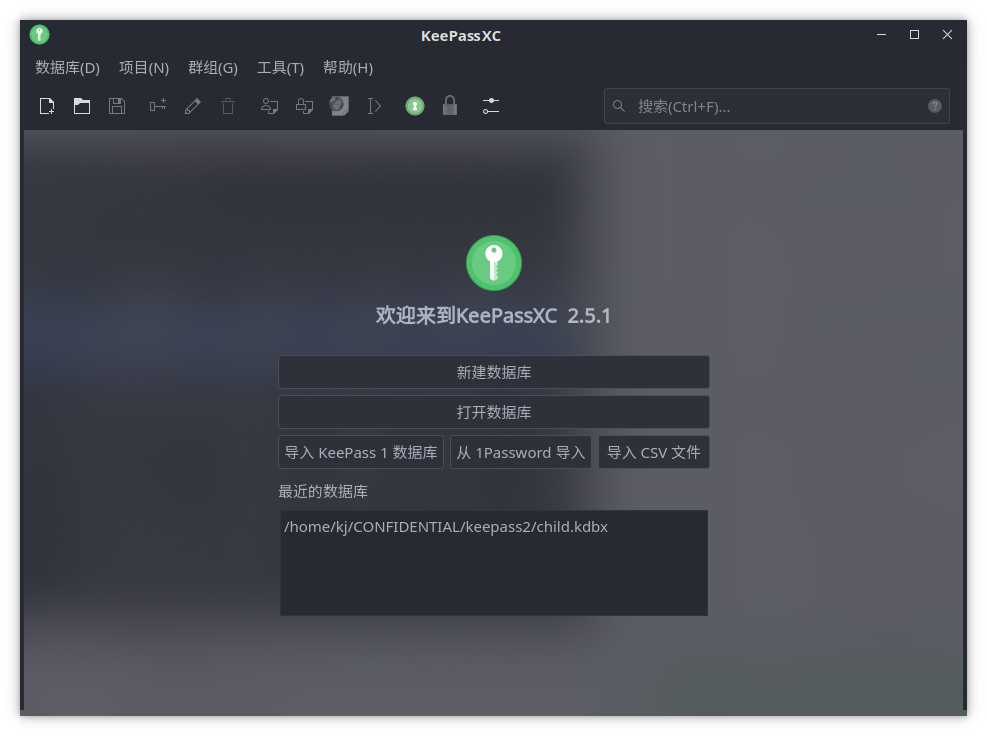
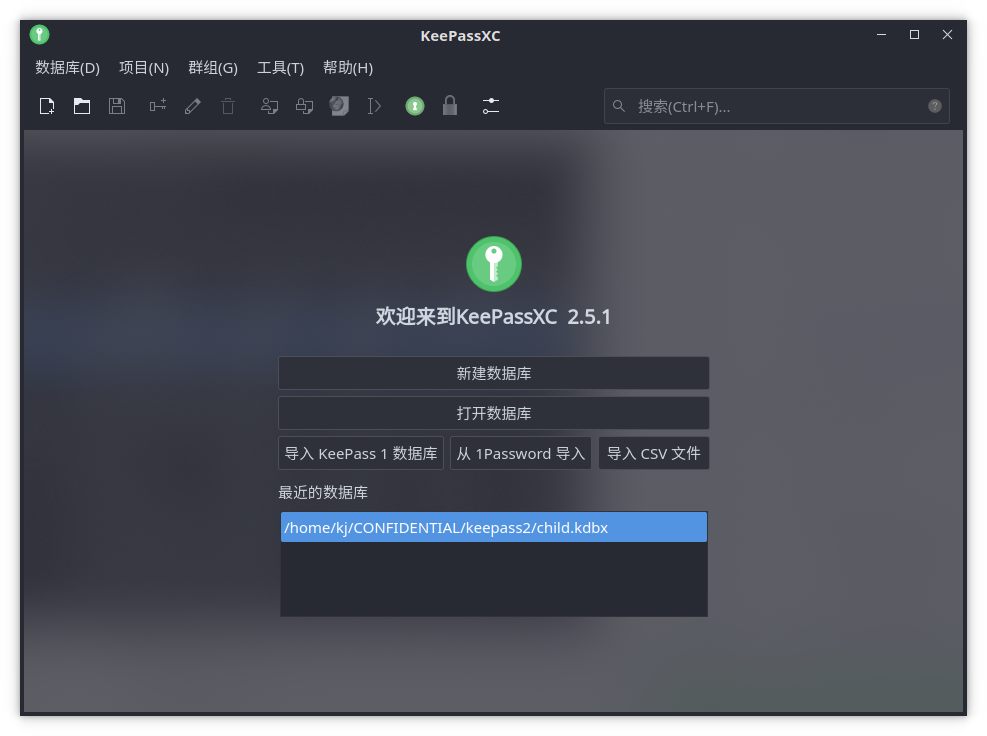

Qogir KJ modified theme
======

This is a theme based on the original [Qogir-kde](https://github.com/vinceliuice/Qogir-kde) theme made by [@vinceliuice](https://github.com/vinceliuice).
This modified version aims at fixing some of the design decisions that I personally found disturbing.

Current modifications include:

* Brighter font color of the Qogir-dark kvantum theme.
  The original color may look fine with solid background. However, with translucent background it may look too blurry.

* Consistent borders of the Qogir-dark-circle aurorae theme (the original version has a translucent bottom border).
  I simply have no idea why it was designed that way.
  
## Comparison

Before:

After:

For info related to the original theme, including installation guides, please find the link to the original theme at the top of the README.
